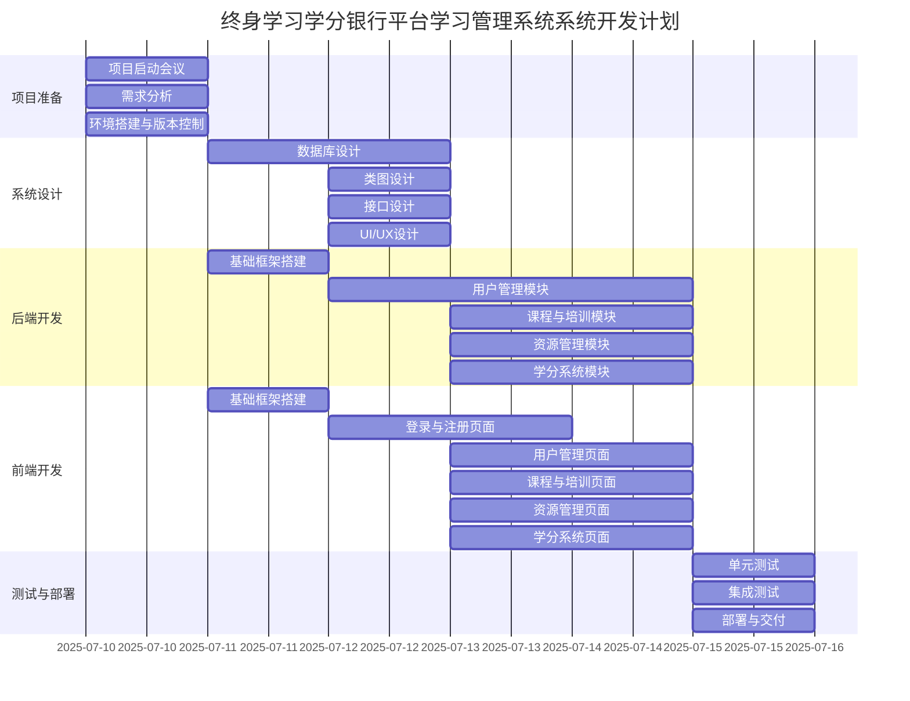

```mermaid
gantt
    todayMarker off
    dateFormat  YYYY-MM-DD
    title 终身学习学分银行平台学习管理系统系统开发计划
    
    section 项目准备
    项目启动会议               :2025-7-10, 1d
    需求分析                  :2025-7-10, 1d
    环境搭建与版本控制        :2025-7-10, 1d
    
    section 系统设计
    数据库设计                :2025-7-11, 2d
    类图设计                  :2025-7-12, 1d
    接口设计                  :2025-7-12, 1d
    UI/UX设计                 :2025-7-12, 1d
    
    section 后端开发
    基础框架搭建              :2025-7-11, 1d
    用户管理模块              :2025-7-12, 3d
    课程与培训模块            :2025-7-13, 2d
    资源管理模块              :2025-7-13, 2d
    学分系统模块              :2025-7-13, 2d
    
    section 前端开发
    基础框架搭建              :2025-7-11, 1d
    登录与注册页面            :2025-7-12, 2d
    用户管理页面              :2025-7-13, 2d
    课程与培训页面            :2025-7-13, 2d
    资源管理页面              :2025-7-13, 2d
    学分系统页面              :2025-7-13, 2d
    
    section 测试与部署
    单元测试                  :2025-7-15, 1d
    集成测试                  :2025-7-15, 1d
    部署与交付                :2025-7-15, 1d
```