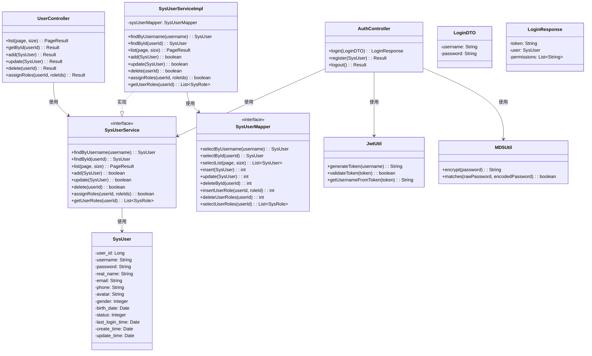
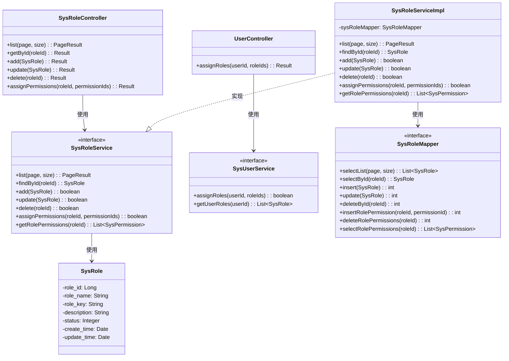
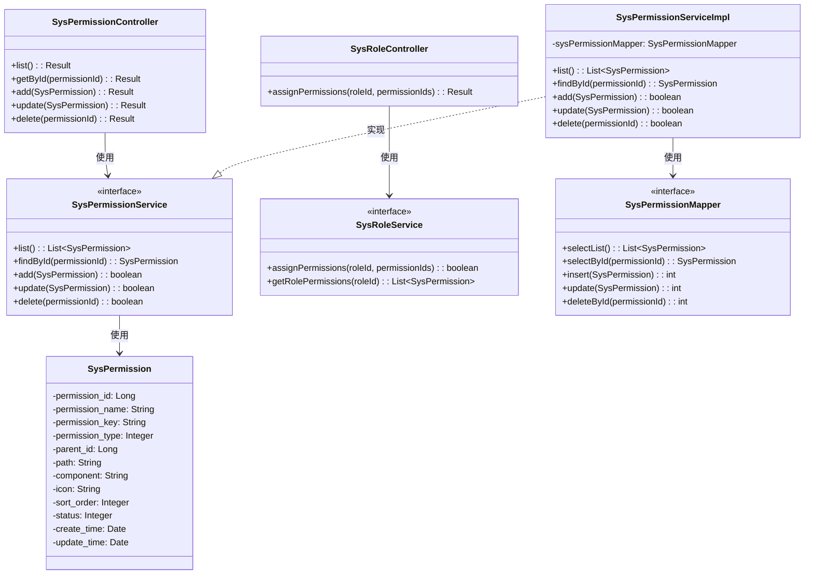
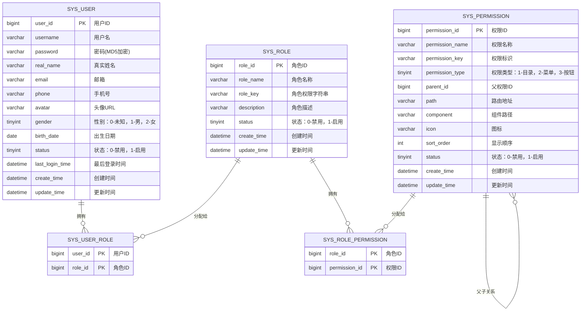
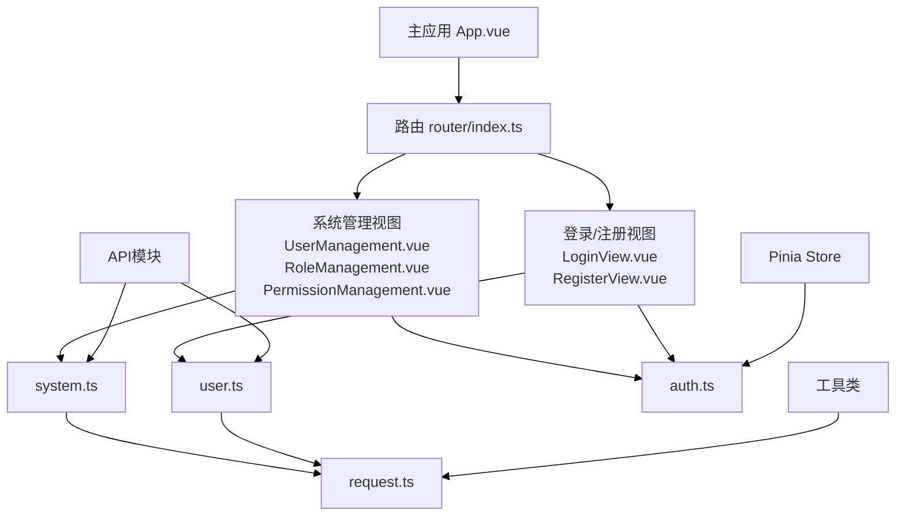
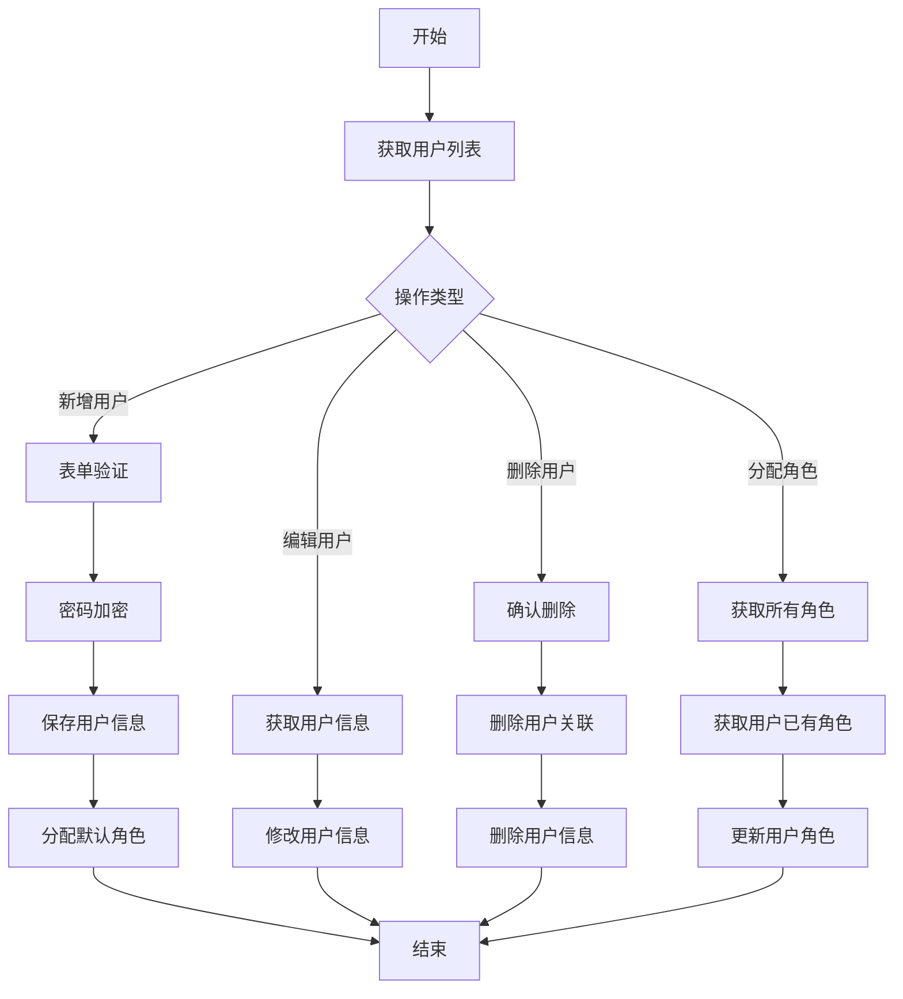
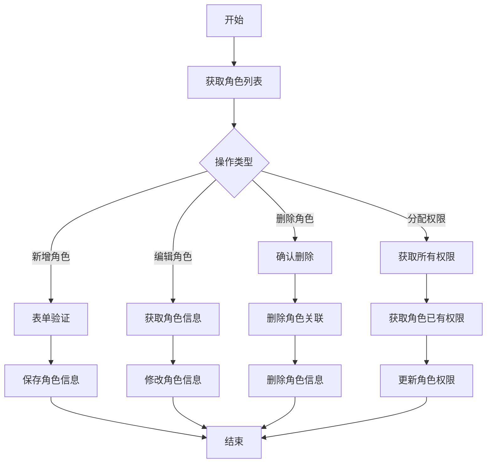
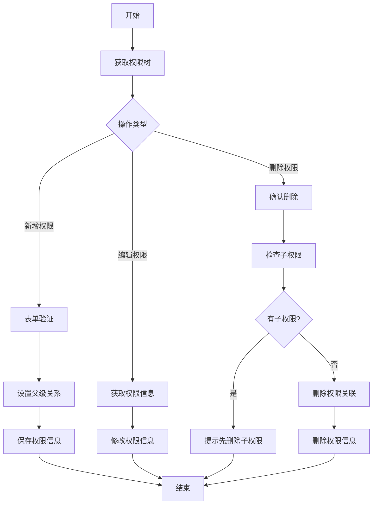
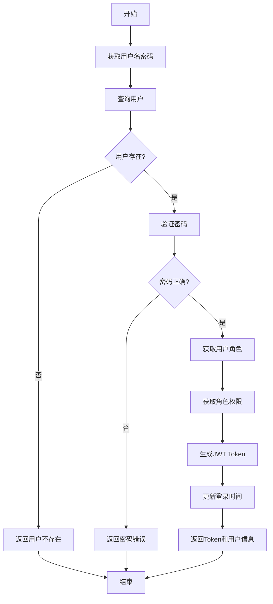

# 银行培训系统工作成果报告

## 目录
1. [项目概述](#项目概述)
2. [技术栈](#技术栈)
3. [系统管理模块分析](#系统管理模块分析)
   - [后端架构](#后端架构)
   - [数据库设计](#数据库设计)
   - [前端架构](#前端架构)
4. [核心功能实现](#核心功能实现)
   - [用户管理](#用户管理)
   - [角色管理](#角色管理)
   - [权限管理](#权限管理)
   - [登录认证](#登录认证)
5. [总结](#总结)

## 项目概述

本项目是一个银行培训系统，包括用户管理、角色权限控制、课程管理、学分管理、资源管理等功能模块。本报告主要聚焦系统管理模块，该模块实现了基于RBAC（基于角色的访问控制）模型的权限管理系统。

## 技术栈

### 后端
- 框架：Spring Boot
- ORM：MyBatis
- 安全认证：JWT
- 数据库：MySQL

### 前端
- 框架：Vue.js
- 状态管理：Pinia
- UI组件库：Element Plus (推测)
- HTTP客户端：Axios

## 系统管理模块分析

### 后端架构

#### 类图分析







### 数据库设计

#### 数据库关系图



#### 数据库表结构说明

1. **sys_user**: 用户表，存储系统用户信息
   - user_id: 用户ID，主键
   - username: 用户名，唯一
   - password: MD5加密后的密码
   - real_name: 真实姓名
   - email: 邮箱，唯一
   - phone: 手机号
   - avatar: 头像URL
   - gender: 性别（0-未知，1-男，2-女）
   - status: 状态（0-禁用，1-启用）

2. **sys_role**: 角色表，存储系统角色信息
   - role_id: 角色ID，主键
   - role_name: 角色名称，唯一
   - role_key: 角色标识，唯一
   - description: 角色描述
   - status: 状态（0-禁用，1-启用）

3. **sys_permission**: 权限表，存储系统权限信息
   - permission_id: 权限ID，主键
   - permission_name: 权限名称
   - permission_key: 权限标识，唯一
   - permission_type: 权限类型（1-目录，2-菜单，3-按钮）
   - parent_id: 父权限ID，实现权限层级结构
   - path: 路由地址
   - component: 组件路径
   - icon: 图标
   - sort_order: 显示顺序

4. **sys_user_role**: 用户角色关联表，维护用户与角色多对多关系
   - user_id: 用户ID，主键
   - role_id: 角色ID，主键

5. **sys_role_permission**: 角色权限关联表，维护角色与权限多对多关系
   - role_id: 角色ID，主键
   - permission_id: 权限ID，主键

### 前端架构

#### 前端架构图



#### 前端分层说明

1. **视图层 (Views)**
   - auth/LoginView.vue: 用户登录界面
   - auth/RegisterView.vue: 用户注册界面
   - system/UserManagement.vue: 用户管理界面
   - system/RoleManagement.vue: 角色管理界面
   - system/PermissionManagement.vue: 权限管理界面

2. **API层 (API)**
   - user.ts: 封装用户相关API
   - system.ts: 封装系统管理相关API

3. **状态管理 (Store)**
   - auth.ts: 管理用户认证状态

4. **工具类 (Utils)**
   - request.ts: 封装Axios请求

## 核心功能实现

### 用户管理

#### 核心逻辑流程



#### 核心代码：用户添加

后端代码：
```java
// UserController.java
@PostMapping("/add")
public Result add(@RequestBody SysUser user) {
    // 检查用户名是否存在
    SysUser existUser = sysUserService.findByUsername(user.getUsername());
    if (existUser != null) {
        return Result.fail("用户名已存在");
    }
    
    // 密码加密
    user.setPassword(MD5Util.encrypt(user.getPassword()));
    
    // 保存用户
    boolean success = sysUserService.add(user);
    return success ? Result.success() : Result.fail("添加用户失败");
}
```

### 角色管理

#### 核心逻辑流程



#### 核心代码：角色权限分配

后端代码：
```java
// SysRoleController.java
@PostMapping("/{roleId}/permissions")
public Result assignPermissions(@PathVariable Long roleId, @RequestBody List<Long> permissionIds) {
    // 检查角色是否存在
    SysRole role = sysRoleService.findById(roleId);
    if (role == null) {
        return Result.fail("角色不存在");
    }
    
    // 分配权限
    boolean success = sysRoleService.assignPermissions(roleId, permissionIds);
    return success ? Result.success() : Result.fail("分配权限失败");
}
```

### 权限管理

#### 核心逻辑流程



#### 核心代码：获取权限树

后端代码：
```java
// SysPermissionServiceImpl.java
public List<SysPermission> getPermissionTree() {
    // 获取所有权限
    List<SysPermission> allPermissions = sysPermissionMapper.selectList();
    
    // 构建权限树
    List<SysPermission> rootPermissions = new ArrayList<>();
    Map<Long, List<SysPermission>> permissionMap = new HashMap<>();
    
    // 按父ID分组
    for (SysPermission permission : allPermissions) {
        if (permission.getParentId() == 0) {
            rootPermissions.add(permission);
        } else {
            if (!permissionMap.containsKey(permission.getParentId())) {
                permissionMap.put(permission.getParentId(), new ArrayList<>());
            }
            permissionMap.get(permission.getParentId()).add(permission);
        }
    }
    
    // 递归构建树
    for (SysPermission rootPermission : rootPermissions) {
        buildPermissionTree(rootPermission, permissionMap);
    }
    
    return rootPermissions;
}

private void buildPermissionTree(SysPermission parent, Map<Long, List<SysPermission>> permissionMap) {
    List<SysPermission> children = permissionMap.get(parent.getPermissionId());
    if (children != null) {
        parent.setChildren(children);
        for (SysPermission child : children) {
            buildPermissionTree(child, permissionMap);
        }
    }
}
```

### 登录认证

#### 核心逻辑流程



#### 核心代码：用户登录认证

后端代码：
```java
// AuthController.java
@PostMapping("/login")
public Result login(@RequestBody LoginDTO loginDTO) {
    // 获取用户名和密码
    String username = loginDTO.getUsername();
    String password = loginDTO.getPassword();
    
    // 查询用户
    SysUser user = sysUserService.findByUsername(username);
    if (user == null) {
        return Result.fail("用户不存在");
    }
    
    // 验证密码
    if (!MD5Util.matches(password, user.getPassword())) {
        return Result.fail("密码错误");
    }
    
    // 获取用户角色和权限
    List<SysRole> roles = sysUserService.getUserRoles(user.getUserId());
    Set<String> permissions = new HashSet<>();
    for (SysRole role : roles) {
        List<SysPermission> rolePermissions = sysRoleService.getRolePermissions(role.getRoleId());
        for (SysPermission permission : rolePermissions) {
            permissions.add(permission.getPermissionKey());
        }
    }
    
    // 生成Token
    String token = JwtUtil.generateToken(username);
    
    // 更新登录时间
    user.setLastLoginTime(new Date());
    sysUserService.update(user);
    
    // 构造返回结果
    LoginResponse loginResponse = new LoginResponse();
    loginResponse.setToken(token);
    loginResponse.setUser(user);
    loginResponse.setPermissions(new ArrayList<>(permissions));
    
    return Result.success(loginResponse);
}
```

前端代码（stores/auth.ts）：
```typescript
import { defineStore } from 'pinia';
import { login, logout, getUserInfo } from '@/api/user';

export const useAuthStore = defineStore('auth', {
  state: () => ({
    token: localStorage.getItem('token') || '',
    user: null,
    permissions: []
  }),
  
  getters: {
    isAuthenticated: (state) => !!state.token,
    hasPermission: (state) => (permission) => state.permissions.includes(permission)
  },
  
  actions: {
    async login(username, password) {
      try {
        const response = await login({ username, password });
        this.token = response.data.token;
        this.user = response.data.user;
        this.permissions = response.data.permissions;
        
        localStorage.setItem('token', this.token);
        return Promise.resolve(response);
      } catch (error) {
        return Promise.reject(error);
      }
    },
    
    async logout() {
      try {
        await logout();
        this.resetState();
        return Promise.resolve();
      } catch (error) {
        return Promise.reject(error);
      }
    },
    
    async getUserInfo() {
      try {
        const response = await getUserInfo();
        this.user = response.data.user;
        this.permissions = response.data.permissions;
        return Promise.resolve(response);
      } catch (error) {
        return Promise.reject(error);
      }
    },
    
    resetState() {
      this.token = '';
      this.user = null;
      this.permissions = [];
      localStorage.removeItem('token');
    }
  }
});
```

## 总结

本报告详细分析了系统管理模块的前后端实现，该模块基于RBAC模型实现了完整的用户、角色、权限管理功能。主要技术亮点包括：

1. **分层架构**：后端采用标准的MVC分层架构，前端实现了视图、API、状态管理的清晰分离
2. **权限管理**：实现了基于RBAC的权限控制，支持多级权限树
3. **JWT认证**：采用JWT实现无状态的用户认证
4. **前端状态管理**：使用Pinia管理全局认证状态
5. **安全性**：密码采用MD5加密存储，接口访问权限控制

系统管理模块作为整个银行培训系统的基础，为其他业务模块提供了可靠的用户权限管理能力，确保系统安全稳定运行。

<style>
  .mermaid .node {
    margin-bottom: 30px; /* 增大节点下边距 */
  }
  .mermaid .edgePath path {
    stroke-dasharray: 0;
    stroke-width: 2px;
  }
</style>